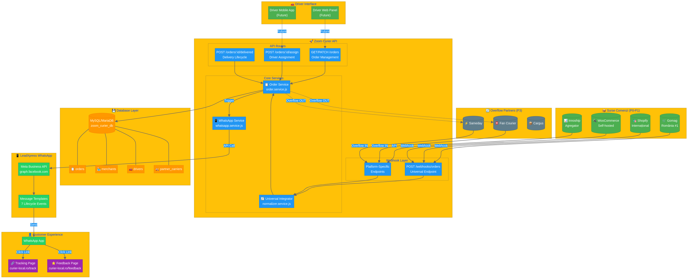
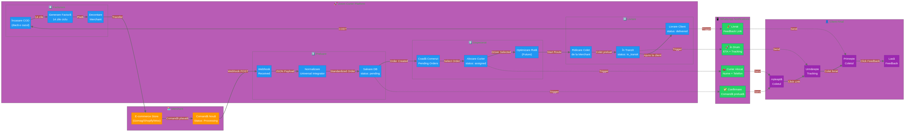
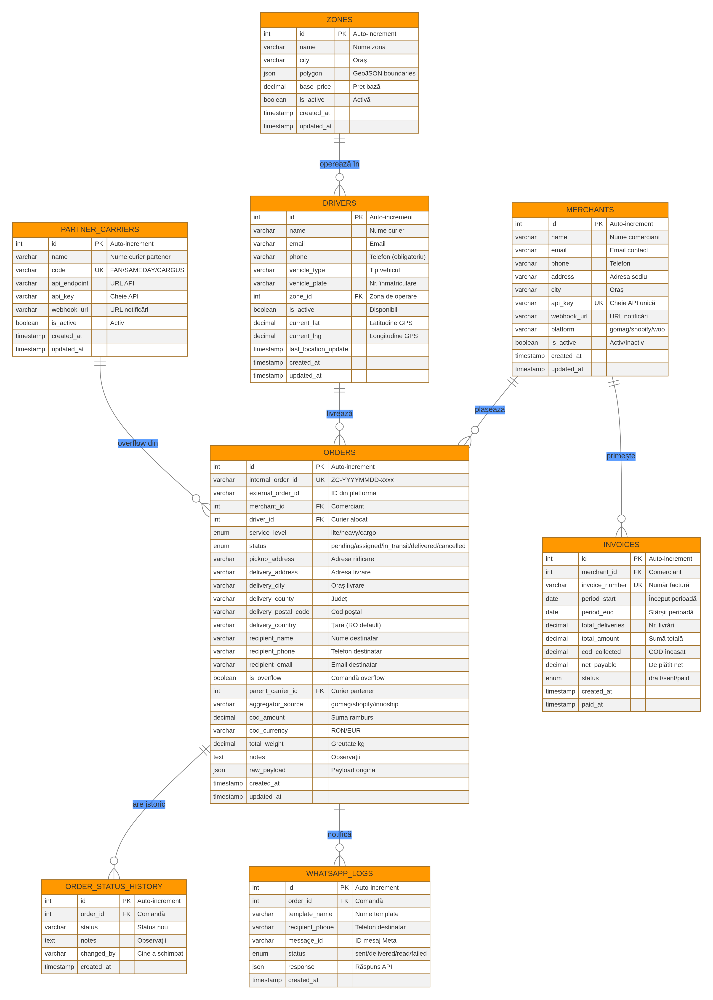
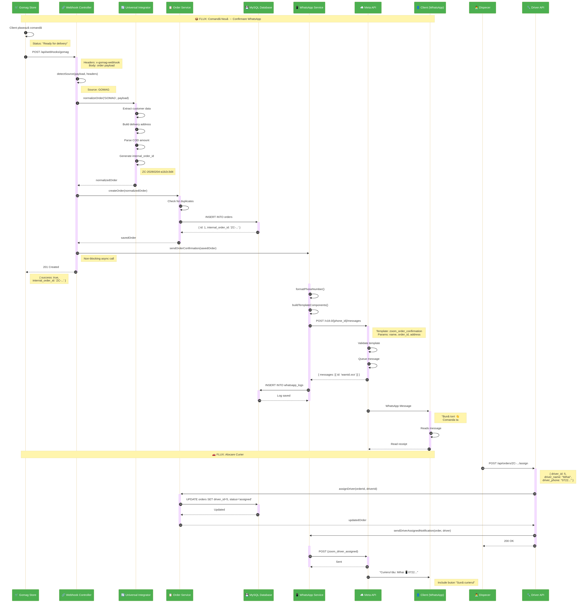

# Zoom Curier - Documentație Arhitectură

Acest document oferă o vedere de ansamblu asupra arhitecturii platformei Zoom Curier / curier-local.ro.

---

## 1. System Architecture Overview



### Descriere

Diagrama prezintă componentele principale ale sistemului:

| Componentă | Rol | Tehnologie |
|------------|-----|------------|
| **Surse Comenzi (P0)** | Platforme e-commerce care trimit comenzi | Gomag, Shopify, WooCommerce |
| **Agregator (P1)** | Canal pasiv de achiziție clienți | Innoship |
| **Overflow Partners (P3)** | Parteneri pentru volume suplimentare | Fan Courier, Sameday, Cargus |
| **Zoom Curier API** | Backend central - Universal Integrator | Node.js / Express |
| **Database** | Stocare date comenzi, comercianți, curieri | MySQL / MariaDB |
| **LeadXpress WhatsApp** | Notificări automate către clienți | Meta Business API |

### Fluxuri Principale

1. **Webhook IN**: Comenzi de la Gomag/Shopify/WooCommerce → API → DB → WhatsApp
2. **Overflow IN**: Comenzi de la Fan/Sameday → API → DB → Livrare Zoom
3. **Overflow OUT**: Comenzi în afara zonei → API → Fan/Sameday

---

## 2. Data Flow - Ciclul de Viață al Comenzii



### Etapele Procesului

| Etapă | Acțiune | Notificare WhatsApp |
|-------|---------|---------------------|
| **1. Preluare** | Webhook → Normalizare → Salvare DB | ✅ Confirmare comandă |
| **2. Dispecerat** | Coadă → Alocare curier → Optimizare rută | 🚗 Curier alocat |
| **3. Livrare** | Ridicare → Tranzit → Livrare | 🚀 În drum + 🎉 Livrat |
| **4. Facturare** | COD → Factură 14 zile → Decontare | - |

### Puncte de Contact cu Clientul

- **Confirmare**: Imediat după plasarea comenzii
- **Curier alocat**: Nume + telefon curier
- **În drum**: ETA + link tracking live
- **Livrat**: Confirmare + link feedback + cod reducere

---

## 3. Database ERD (Entity Relationship Diagram)



### Tabele Principale

| Tabel | Descriere | Relații |
|-------|-----------|---------|
| `orders` | Comenzi normalizate | → merchants, drivers, partner_carriers |
| `merchants` | Comercianți înregistrați | ← orders, invoices |
| `drivers` | Curieri activi | ← orders, zones |
| `partner_carriers` | Parteneri overflow | ← orders (overflow) |
| `order_status_history` | Istoric schimbări status | → orders |
| `zones` | Zone de operare | ← drivers |
| `invoices` | Facturi generate | → merchants |
| `whatsapp_logs` | Log notificări WhatsApp | → orders |

### Câmpuri Cheie în `orders`

```sql
internal_order_id    -- ID unic Zoom (ZC-YYYYMMDD-xxxx)
external_order_id    -- ID din platforma sursă
aggregator_source    -- gomag / shopify / woocommerce / innoship
is_overflow          -- TRUE dacă e de la partener
parent_carrier_id    -- FK către partner_carriers
status               -- pending / assigned / in_transit / delivered / cancelled
```

---

## 4. Sequence Diagram - Procesare Webhook



### Flux Detaliat: Comandă Nouă → Confirmare WhatsApp

1. **Gomag** trimite webhook `POST /api/webhooks/gomag`
2. **Webhook Controller** detectează sursa și validează payload
3. **Universal Integrator** normalizează datele în format standard
4. **Order Service** verifică duplicate și salvează în DB
5. **WhatsApp Service** (async) trimite confirmare către client
6. **Response** 201 Created returnat către Gomag

### Timp de Răspuns

- **Webhook processing**: < 500ms
- **WhatsApp delivery**: 1-3 secunde (async)

---

## 5. Integrări Externe

### P0: Surse Directe

| Platformă | Endpoint | Trigger |
|-----------|----------|---------|
| Gomag | `POST /api/webhooks/gomag` | Status "Ready for delivery" |
| Shopify | `POST /api/webhooks/shopify` | Event `orders/create` |
| WooCommerce | `POST /api/webhooks/woocommerce` | Event `order.created` |

### P1: Agregator

| Platformă | Endpoint | Model |
|-----------|----------|-------|
| Innoship | `POST /api/webhooks/innoship` | Carrier-as-a-Service |

### P3: Overflow Partners

| Curier | Overflow IN | Overflow OUT |
|--------|-------------|--------------|
| Fan Courier | `POST /api/webhooks/overflow` | API Fan Courier |
| Sameday | `POST /api/webhooks/overflow` | API Sameday |

---

## 6. Stack Tehnologic

| Layer | Tehnologie | Versiune |
|-------|------------|----------|
| **Runtime** | Node.js | 18+ |
| **Framework** | Express.js | 4.18 |
| **Database** | MySQL / MariaDB | 8.0+ |
| **ORM** | mysql2 (raw queries) | 3.6 |
| **WhatsApp** | Meta Business API | v18.0 |
| **Hosting** | Railway / VPS | - |

---

## 7. Securitate

### Autentificare Webhooks

- **Shopify**: HMAC-SHA256 signature verification
- **WooCommerce**: Webhook secret validation
- **Gomag**: API key header
- **Innoship**: API key + signature

### Rate Limiting

- 100 requests/minut per IP
- 1000 requests/minut per merchant API key

### GDPR Compliance

- Date minime colectate
- Retenție 90 zile pentru logs
- Drept la ștergere implementat

---

## 8. Deployment

### Development

```bash
USE_IN_MEMORY_DB=true
WHATSAPP_DRY_RUN=true
```

### Production

```bash
USE_IN_MEMORY_DB=false
WHATSAPP_DRY_RUN=false
WHATSAPP_ENABLED=true
```

---

## 9. Next Steps

1. **Deploy pe Railway** - URL public pentru webhooks
2. **Configurare Gomag** - Adăugare webhook URL
3. **Aprobare Templates** - Meta Business Manager
4. **Testare E2E** - Flux complet comandă → livrare

---

*Documentație generată pentru Zoom Curier / curier-local.ro*
*Versiune: 1.0.0 | Data: Februarie 2026*
